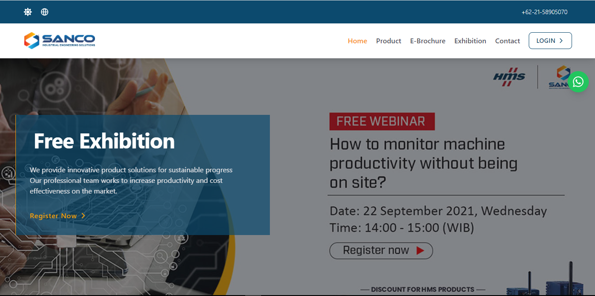
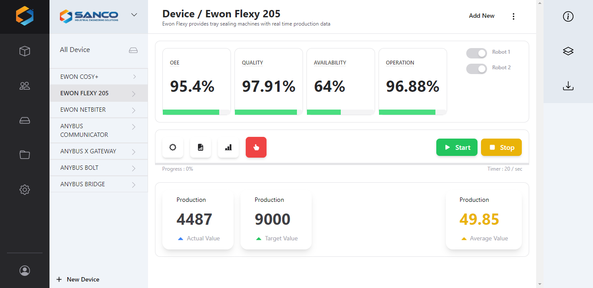

# Sanco Apps- Build Using Svelte + Supabase ( Development Only )
> Note: this application under development, i will share this source code for studies together ( Not Recomended for Production )

This sanco application for IoT, i build it for dashboard on IoT solution in sanco indonesia
Everything you need to build a Svelte project, powered by [`create-svelte`](https://github.com/sveltejs/kit/tree/master/packages/create-svelte);

<br> 



## Creating a project

If you're seeing this, you've probably already done this step. Congrats!

```bash
# create a new project in the current directory
npm init svelte@next

# create a new project in my-app
npm init svelte@next my-app
```

> Note: the `@next` is temporary

## Developing

Once you've created a project and installed dependencies with `npm install` (or `pnpm install` or `yarn`), start a development server:

```bash
npm run dev

# or start the server and open the app in a new browser tab
npm run dev -- --open
```

## Building

Before creating a production version of your app, install an [adapter](https://kit.svelte.dev/docs#adapters) for your target environment. Then:

```bash
npm run build
```

> You can preview the built app with `npm run preview`, regardless of whether you installed an adapter. This should _not_ be used to serve your app in production.

<br>
<a href="https://www.buymeacoffee.com/ikziriv" target="_blank"></a>

_Thank you!_
